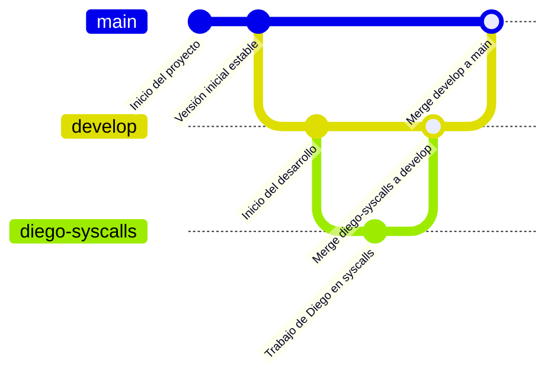

# Objetivos:
- Aprender a compilar el kernel de Linux.
- Aprender a realizar modificaciones al kernel de Linux.
- Comprender como funcionan las llamadas al sistema de Linux.

# Configuración del entorno:

# Instrucciones:
Vamos a dividir el proyecto en 3 partes y asignar las tareas de la siguiente forma:
- Josué: descargar y modificar el kernel de Linux, modificaciones:
  - mandar un mensaje personalizado al registro de inicio del kernel que dé la bienvenida al usuario cuando se inicie el kernel, en nuestro caso pondremos `"Bienvenido a usac-kernel-1128-7639-3856"` (Siendo esos numeros los ultimos cuatro dijitos de nuestros carnets: 202201128, 2022017639, 202203856).
  - modificar el valor de UTS SYSNAME, para que el nombre del kernel sea `usac-kernel-1128-7639-3856`.
- Álvaro: implementar las siguientes llamadas al sistema:
  - `get_time_sec`: una nueva llamada al sistema que devuelva la hora actual en segundos desde el epoch linux.
  - `get_logs`: una llamada al sistema que devuelva los últimos 5 mensajes del registro del kernel.
  - `warn_signal`: una llamada que detecte comandos no permitidos si alguien corre netcat, nmap, ssh, etc., el kernel lo detecta y lanza un mensaje: "Advertencia: intento de uso de herramienta de red por PID: {pid}".
- Diego: última llamada al sistema y documentación:
  - `panic_signal`: una llamada que imprime un mensaje de emergencia y detiene el sistema con: "USAC Linux: Modo pánico activado por el usuario {username}".
  - Documentar el proyecto en el README.md, explicando los pasos para compilar el kernel, las modificaciones realizadas y cómo probar las nuevas llamadas al sistema.

Las modificaciones del kernel iran en la carpeta `kmods` y las llamadas al sistema en la carpeta `syscalls`. En cada una de estas carpetas habrá un README.md que explica de donde vienen las modificaciones y qué archivo modifican. 

Un ejemplo de como se vería un README.md en la carpeta `kmods`:

# Modificar el nombre del kernel:

## Direccion: `include/linux/uts.h`
Linea 9:
```c
#define UTS_SYSNAME "Linux"
```
Modificacion de línea 9:
```c
#define UTS_SYSNAME "usac-kernel-1128-7639-3856"
```
>[!note]
> Se debe agregar el **SOLO** archivo modificado en la carpeta `kmods` para que se compile al momento de compilar el kernel. Si hay otros archivos que se modifican, se debe agregar en el mismo formato, indicando la dirección del archivo y la línea que se modifica.

# Syscalls enlaces:
Los enlaces de las llamadas ocurren en la carpeta:
`arch/x86/entry/syscalls/syscall_64.tbl`

En ese archivo se deben agregar las nuevas llamadas al sistema, de la siguiente manera:
| linea | no. llamada | abi    | nombre | entry point |
|-------|-------------|--------|--------|-------------|
| 378   | 454         | common | get_time_sec | sys_get_time_sec |
| ...   | ...         | ... | ... | ... |
| 381   | 457         | common | panic_signal | sys_panic_signal |

# Manejo de ramas:
Usaremos el flujo de trabajo parecido a Git Flow, con las siguientes ramas:
- `develop`: rama proveniente del `main` donde se desarrollará el proyecto.
- de la rama `develop` se crearán ramas para cada tarea asignada, por ejemplo:
  - `josue-kernel-mods`
  - `alvaro-syscalls`
  - `diego-syscalls`
- Por ultimo, al finalizar cada tarea, se hará un merge a la rama `develop` y luego se hará un merge a la rama `main`.

# Diagrama de flujo de trabajo:
