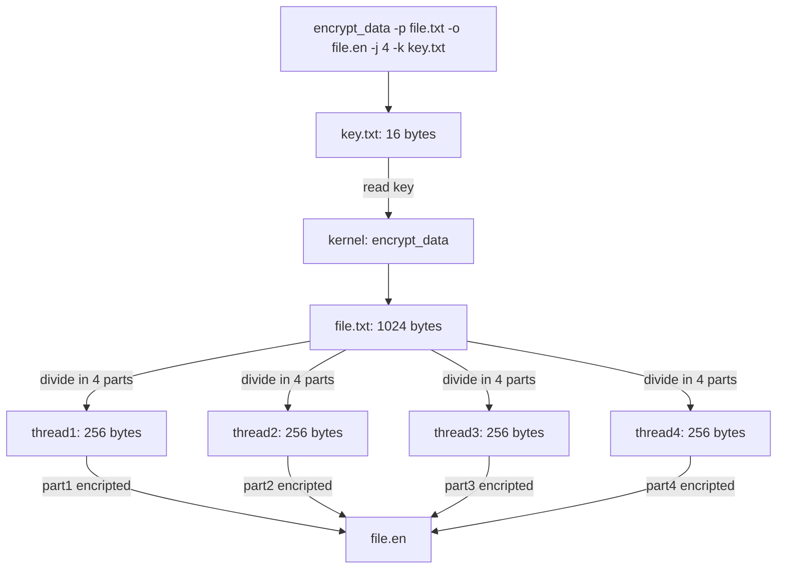
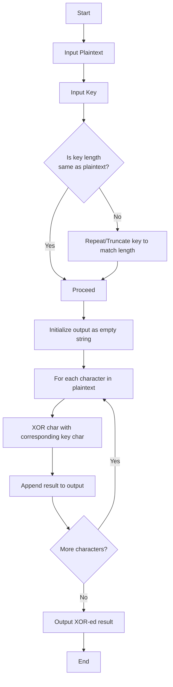
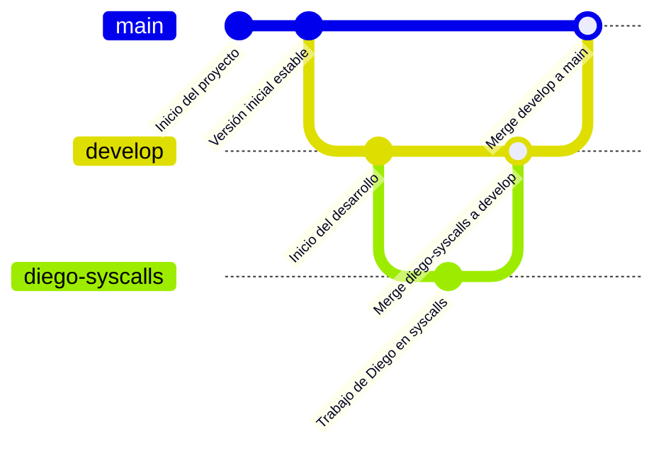

# Instrucciones
## División de tareas:
- **Josué:** Implementación del módulo de encriptación. Debe compilar en el kernel lafunción `encrypt_data` que encripta datos utiliando un algoritmo XOR.
- **Álvaro:** Implementación del módulo de des-encriptación. Debe compilar en el kernel la función `decrypt_data` que des-encripta datos utilizando el mismo algoritmo XOR.
- **Diego:** Aplicaciones de modulos. Con las llamadas del sistema `encrypt_data` y `decrypt_data`, debe crear una aplicación que permita al usuario encriptar y des-encriptar datos desde la terminal.

## Funcionamiento de los modulos de encriptación y des-encriptación:
Ambos módulos tendran los mismos argumentos:
- `file_route_in`: Ruta del archivo de entrada.
- `file_route_out`: Ruta del archivo de salida.
- `thread_count`: Cantidad de hilos a utilizar para el procesamiento de los datos.
- `key_file_route`: Ruta del archivo que contiene la clave de encriptación/des-encriptación.

La unica diferencia entre los modulos será el output de la función, uno retornará el archivo encriptado y el otro el archivo des-encriptado.

Ya que el algorítmo será implementado con hilos, se debe tener en cuenta que el archivo de entrada será dividido en partes iguales según la cantidad de hilos. Cada hilo procesará una parte del archivo y escribirá el resultado en el archivo de salida. Es importante tener en cuenta el orden de los hilos para que no haya errores en el archivo de salida.

Existirán 3 carpetas principales `app`, `decrypt` y `encrypt`, cada una contendrá un README.md que explique el funcionamiento de la aplicación, los argumentos que recibe y la dirección de los archivos que se deben modificar para compilar el kernel.

### Ejemplo de README.md en la carpeta `encrypt`:
```markdown
# Módulo de Encriptación `/kernel/sys.c`
## Descripción
Este módulo permite encriptar datos utilizando un algoritmo XOR. La función `encrypt_data` toma un archivo de entrada, lo divide en partes iguales según la cantidad de hilos especificada, y utiliza una clave de encriptación para procesar cada parte.
## Argumentos
- `file_route_in`: Ruta del archivo de entrada.
- `file_route_out`: Ruta del archivo de salida.
- `thread_count`: Cantidad de hilos a utilizar para el procesamiento de los datos.
- `key_file_route`: Ruta del archivo que contiene la clave de encriptación.
## Funcionamiento
La función `encrypt_data` lee el archivo de entrada, lo divide en partes iguales según la cantidad de hilos, y cada hilo procesa su parte utilizando la clave de encriptación. El resultado se escribe en el archivo de salida.

// Un ejemplo de uso...
```

### Encriptación y des-encriptación figura:

### XOR algoritmo:

# Diagrama de flujo de trabajo:
