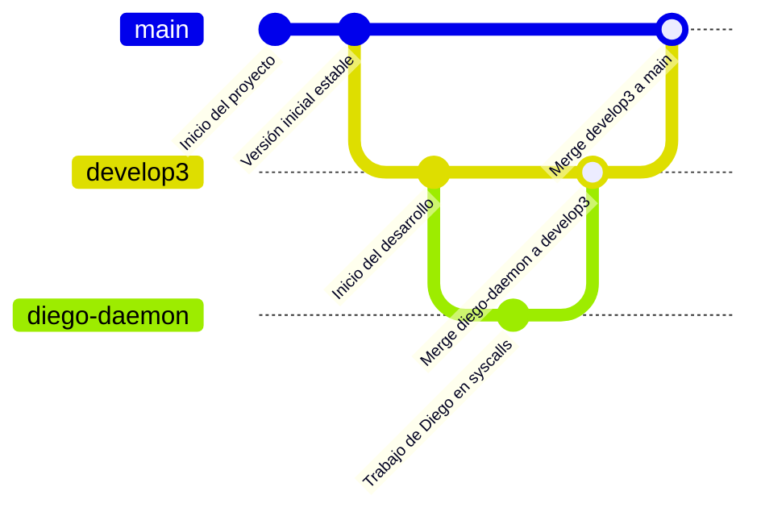

# Instrucciones

## Desglose de la Fase 3
El objetivo es desarrollar un sistema de antivirus a nivel de kernel dividido en las siguientes partes:
- Llamadas al sistema para monitorear y analizar el uso de memoria por proceso.
- Un módulo antivirus que identifique patrones sospechosos (Ej: uso excesivo de swap, muchos fallos de página, etc.)
- Una interfaz en espacio de usuario para reportes y comunicación con un dashboard.
- Un dashboard visual que actúe como consola del antivirus, mostrando alertas y el estado en tiempo real.

## Nombre del anrivirus: `USAC-AV`

## División del trabajo:
- Alvaro: Implementación de las [llamadas al sistema](#llamadas-al-sistema), deberá trabajar en la carpeta `/syscalls`.
-  Diego: Implementación del [daemon del antivirus](#daemon-del-antivirus) deberá trabajar en la carpeta `/daemon`.
-  Josué: Implementación del [dashboard web](#dashboard-web) deberá trabajar en la carpeta `/dashboard`.

## Llamadas al sistema:
- **Monitoreo de procesos en tiempo real**: detecta procesos con consumo anómalo de memoria, fallos de página elevados, uso de swap excesivo o características típicas de malware.
- **Escaneo de archivos con firmas**: análisis de ejecutables o documentos, calculando hashes y comparándolos con una base de datos de firmas conocidas (un archivo `signatures.db`).
- **Gestión de cuarentena**: los archivos detectados como maliciosos se aíslan en un entorno seguro, en el dashboard se pueden ver los archivos en cuarentena y se pueden eliminar o restaurar.

### Sugerencia de syscalls:
- `sys_scan_processes()`: para monitorear procesos en tiempo real.
- `sys_get_page_faults(pid)`: para obtener estadísticas de fallos de página por proceso.
- `sys_scan_file(path)`: para escanear archivos y calcular hashes.
- `sys_quarantine_file(path)`: para mover archivos sospechosos a cuarentena.
- `sys_get_quarantine_list()`: para obtener la lista de archivos en cuarentena.
- `sys_restore_file(filename)`: para restaurar archivos desde cuarentena.
- `sys_antivirus_stats()`: para obtener estadísticas del antivirus, como número de procesos monitoreados, archivos escaneados, etc.

> [!NOTE]
> Queda a discreción si se hace una CLI para la interfaz de control del antivirus o si se implementa una interfaz gráfica.

## Daemon del antivirus:
Este programa funcionará como intermediario entre las llamadas al sistema en el kernel y la capa de presentación del usuario. Este programa se encargará de invocar periodicamente las syscalls para monitorear el sistema y enviar alertas al dashboard en formato JSON mediante solicitudes HTTP o a través de websockets.
### El archivo JSON
Debe contener información relevante como:
```JSON
{
    "used_memory": -1,
    "free_memory": -1,
    "cache_memory": -1,
    "used_swap": -1,
    "minor_faults": -1,
    "major_faults": -1,
    "active_pages": -1,
    "inactive_pages": -1,
    "processes_top": [
        {
            "name": "process_name",
            "pid": 1234,
            "memory_percent": 12.34,
        },
        //...
    ],
}
```
Ademas de que habran otras peticiones que se pueden hacer al daemon...

## Dashboard Web:
El dashboard web debe mostrar la información del antivirus de manera visual y amigable en tiempo real. Métricas sugeridas:
- **Uso de memoria**: Grafico de Pie, memoria usada, libre y cache con el objetivo de mostrar el estado general de la asignación de memoria.
- **Evolución del uso de memoria en el tiempo**: Gráfico de líneas que muestre el uso de memoria física vs. swap a lo largo del tiempo.
- **Tasa de fallos de página**: Gráfico de barras que muestre la tasa de fallos de página menores y mayores por proceso.
- **Estado de páginas de memoria**: Gráfico de Pie que muestre la proporción de páginas activas e inactivas.
- **Procesos que consumen más memoria**: Tabla o grafico de barras que muestre los procesos con mayor consumo de memoria, ordenados por porcentaje de uso.

# Diagrama de flujo de trabajo:
