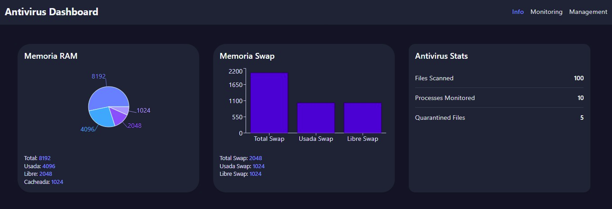
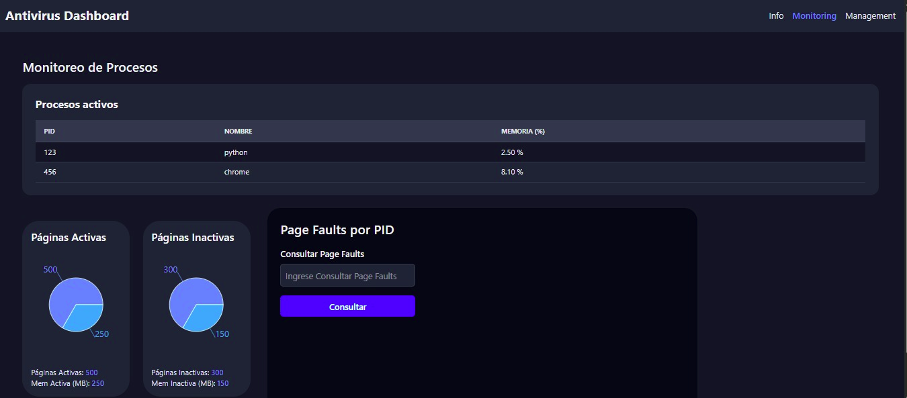
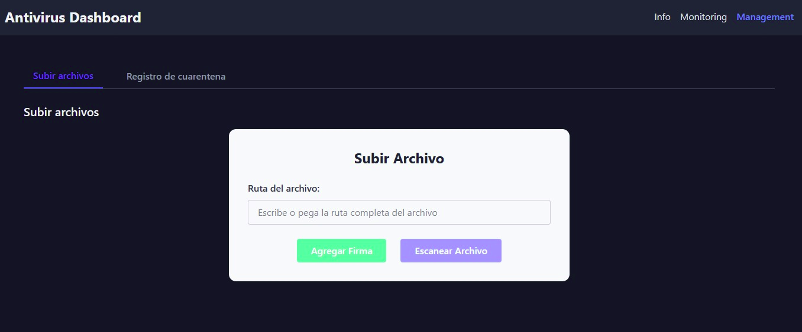
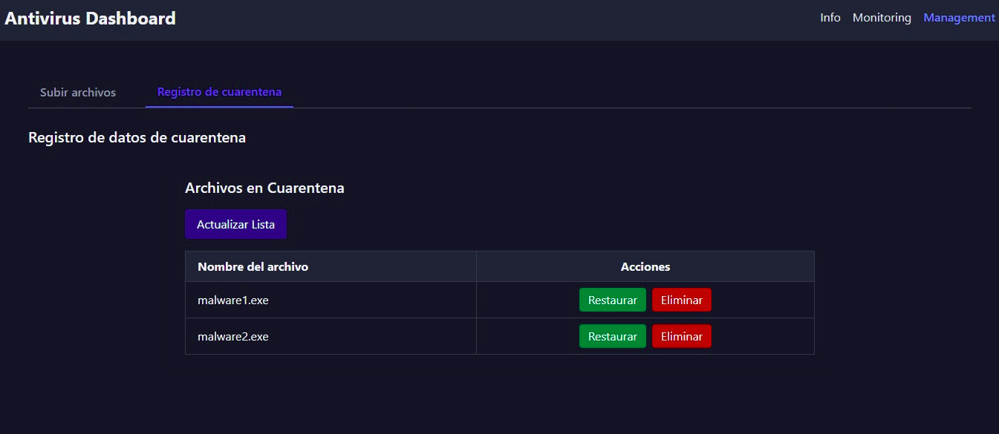

# Documentación Fase 3

## Syscalls y compilación del Kernel:
Darémos por hecho que ya sabemos como compilar el kernel así que solo agregarémos las syscalls. Las syscalls implementadas son las siguientes:
| Syscall | Número | Descripción |
|---------|--------|-------------|
| sys_scan_processes | 550 | Escanea los procesos del sistema y devuelve información sobre ellos. |
| sys_get_page_faults | 551 | Obtiene información sobre los fallos de página de un proceso específico. |
| sys_get_memory_usage | 552 | Obtiene información sobre el uso de memoria del sistema. |
| sys_get_pages | 553 | Obtiene información sobre las páginas de memoria activas e inactivas del sistema. |

## Instalación del Daemon:

Instalar las dependencias necesarias:
```bash
sudo apt install libjson-c-dev 
```
ejecutar el siguiente comando en la terminal:
```bash
make
```
Luego ingresar como root:
```bash
sudo su
```
Luego en la carpeta `/dist` ejecutar el siguiente comando:
```bash
./main
```

## API Endpoints
La API está disponible en `http://localhost:8080/api/`. 

### `GET /api/mem_stats`
Retorna:
```
{
  "memory": {
    "total_memory": <int>,
    "used_memory": <int>,
    "free_memory": <int>,
    "cached_memory": <int>
  }, 
  "swap": {
    "total_swap": <int>,
    "used_swap": <int>,
    "free_swap": <int>
  }
}
```

### `GET /api/processes`
Retorna:
```
{
  "processes": [
    {"pid": <int>, "name": "<name>", "mem_percent": <float>},
    {"pid": <int>, "name": "<name>", "mem_percent": <float>}
  ]
}
```

### `GET /api/antivirus_stats`
Retorna:
```
{
  "processes_monitored": <int>,
  "files_scanned": <int>,
  "quarantined_files": <int>
}
```

### `GET /api/quarantine_files`
Retorna:
```
{
  "files": [
    {"name": "<filename>"},
    {"name": "<filename>"}
  ]
}
```

### `GET /api/pages`
Retorna:
```
{
  "active_pages": <int>,
  "active_pages_mem": <int>,
  "inactive_pages": <int>,
  "inactive_pages_mem": <int>,
}
```


### `POST /api/page_faults`
Body:
```
{
  "pid": <int>
}
```
Retorna:
```
{
  "pid": <pid>,
  "minor_faults": <int>,
  "major_faults": <int>
}
```

### `POST /api/scan_file`
Body:
```
{
  "file_path": "<ruta>",
  "hash": "<hash>"
}
```
Retorna:
```
{
  "status": <int>,
  "hash": "<hash>",
  "file_path": "<ruta>"
}
```

### `POST /api/quarantine_file`
Body:
```
{
  "file_path": "<ruta>"
}
```
Retorna:
```
{
  "status": <int>,
  "file_path": "<ruta>"
}
```

### `POST /api/restore_file`
Body:
```
{
  "filename": "<name>"
}
```
Retorna:
```
{
  "status": <int>,
  "filename": "<name>"
}
```

### `POST /api/delete_file`
Body:
```
{
  "filename": "<name>"
}
```
Retorna:
```
{
  "status": <int>,
  "filename": "<name>"
}
```

### `POST /api/add_signature`
Body:
```
{
  "file_path": "<ruta>",
  "hash": "<hash>"
}
```
Retorna:
```
{
  "status": <int>,
  "file_path": "<ruta>"
}
```

## Interfáz gráfica:

### Información del sistema:

> Aqui se muestra la información de memoria y estadísticas del antivirus.

### Monitoreo de procesos:

> Aquí se muestran los procesos activos y su uso de memoria, además de las páginas activas e inactivas y los fallos de página.

### Gestión de archivos:

> Aquí se manda la ruta del archivo que se desea escanear o agregar a una base de datos de firmas.


> Aquí se muestran los archivos en cuarentena y se pueden restaurar o eliminar.

